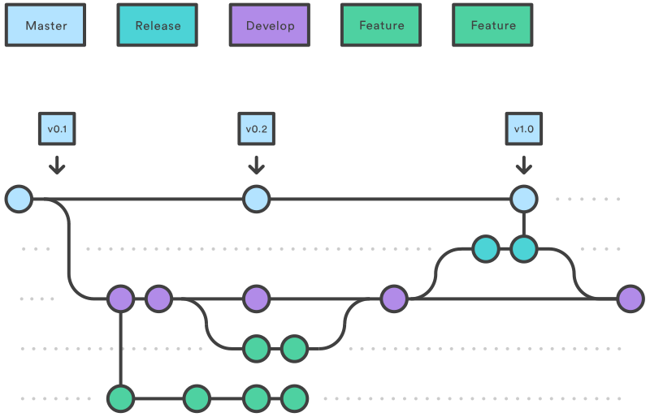

# Gitflow 工作流

## 1. Decentralized but centralized
Git 作为去中心化的版本管理工具，依然有一个中心版本库，我们把这个中心版本库称为`origin`。对于开发者来说，origin是处在远端的一个服务。

## 2. The Main Branches
中心版本库`origin`上有两个永久的分支：

* `master` 存储正式发布的历史，每个发布版本都打上对应版本的tag
* `develop` 存储开发中的下一个版本，是功能的集成分支，可以作为每日构建的源

### 2.1 两个分支的关系
* `develop` 分支创建自 `master`；
* `develop` 分支到达发布阶段后会创建出专门的发布分支，发布分支验收通过后的版本合并入 `master` ，并在 `master` 上打上对应版本的tag；此发布版本与 `develop` 分支合并，成为新的开发版本的基线

## 3. Supporing Branches
除了两条主分支外，还有一些支持分支，用来满足开发过程中的**多功能同步开发**、**产品发布**和**线上问题快速修复**等场景。这些支持分支的生命周期比较短，在对应场景结束的时候都会被删除。

* Feature branches 多功能同步开发专用，每个功能一个分支
* Release branches 产品发布专用，验收通过合并入master
* Hotfix branches 线上问题debug分支，结束后分别合并入master和develop

### 3.1 Feature branches
* May branch off from: `develop`
* Must merge back into: `develop`
* Branch naming convention: anything except `master`, `develop`, `release-*`, or `hotfix-*`

	# 从 develop 上创建功能分支
	$ git checkout -b myfeature develop
	Switched to a new branch "myfeature"
	# 把开发完毕的功能分支合并回 develop
	$ git checkout develop
	Switched to branch 'develop'
	$ git merge --no-ff myfeature
	Updating ea1b82a..05e9557
	(Summary of changes)
	$ git branch -d myfeature
	Deleted branch myfeature (was 05e9557).
	$ git push origin develop

功能分支加上develop分支就是功能分支工作流的用法。但Gitflow工作流没有在这里止步。

### 3.2 Release branches
* May branch off from: `develop`
* Must merge back into: `develop` and `master`
* Branch naming convention: `release-*`

一旦develop分支上有了做一次发布（或者说快到了既定的发布日）的足够功能，就从develop分支上fork一个发布分支。 新建的分支用于开始发布循环，所以从这个时间点开始之后新的功能不能再加到这个分支上—— 这个分支只应该做Bug修复、文档生成和其它面向发布任务。 一旦对外发布的工作都完成了，发布分支合并到master分支并分配一个版本号打好Tag。 另外，这些从新建发布分支以来的做的修改要合并回develop分支。

使用一个用于发布准备的专门分支，使得一个团队可以在完善当前的发布版本的同时，另一个团队可以继续开发下个版本的功能。 这也打造定义良好的开发阶段（比如，可以很轻松地说，『这周我们要做准备发布版本4.0』，并且在仓库的目录结构中可以实际看到）。

	# 从 develop 上创建发布分支
	$ git checkout -b release-1.2 develop
	Switched to a new branch "release-1.2"
	$ ./set-version.sh 1.2 # 设置产品版本
	Files modified successfully, version bumped to 1.2.
	$ git commit -a -m "Bumped version number to 1.2"
	[release-1.2 74d9424] Bumped version number to 1.2
	1 files changed, 1 insertions(+), 1 deletions(-)
	# 结束发布分支: merge、tag、delete
	$ git checkout master
	Switched to branch 'master'
	$ git merge --no-ff release-1.2
	Merge made by recursive.
	(Summary of changes)
	$ git tag -a 1.2

### 3.3 Hotfix branches
* May branch off from: `master`
* Must merge back into: `develop` and `master`
* Branch naming convention: `hotfix-*`

维护分支用于生成快速给产品发布版本（production releases）打补丁，这是唯一可以直接从master分支fork出来的分支。 修复完成，修改应该马上合并回master分支和develop分支（当前的发布分支），master分支应该用新的版本号打好Tag。

为Bug修复使用专门分支，让团队可以处理掉问题而不用打断其它工作或是等待下一个发布循环。 你可以把维护分支想成是一个直接在master分支上处理的临时发布。

	# 从 master 上创建维护分支
	$ git checkout -b hotfix-1.2.1 master
	Switched to a new branch "hotfix-1.2.1"
	$ ./set-version.sh 1.2.1 # 设置产品版本，版本号第三位升级
	Files modified successfully, version bumped to 1.2.1.
	$ git commit -a -m "Bumped version number to 1.2.1"
	[hotfix-1.2.1 41e61bb] Bumped version number to 1.2.1
	1 files changed, 1 insertions(+), 1 deletions(-)
	# 修复bug & 提交更新
	$ git commit -m "Fixed severe production problem"
	[hotfix-1.2.1 abbe5d6] Fixed severe production problem
	5 files changed, 32 insertions(+), 17 deletions(-)
	# 结束发布分支: merge back&tag on master、merge back develop、delete
	$ git checkout master
	Switched to branch 'master'
	$ git merge --no-ff hotfix-1.2.1
	Merge made by recursive.
	(Summary of changes)
	$ git tag -a 1.2.1
	...
	$ git branch -d hotfix-1.2.1
	Deleted branch hotfix-1.2.1 (was abbe5d6).

## 4. 参考
- [A successful Git branching model](http://nvie.com/posts/a-successful-git-branching-model/) 介绍日常推荐的分支开发模型，基于此模型可以通过这个小游戏来进行学习 [Learn Git Branch](http://pcottle.github.io/learnGitBranching/)
- [Gitflow 工作流](https://github.com/oldratlee/translations/blob/master/git-workflows-and-tutorials/workflow-gitflow.md) @oldratlee 整理的 Gitflow 工作流